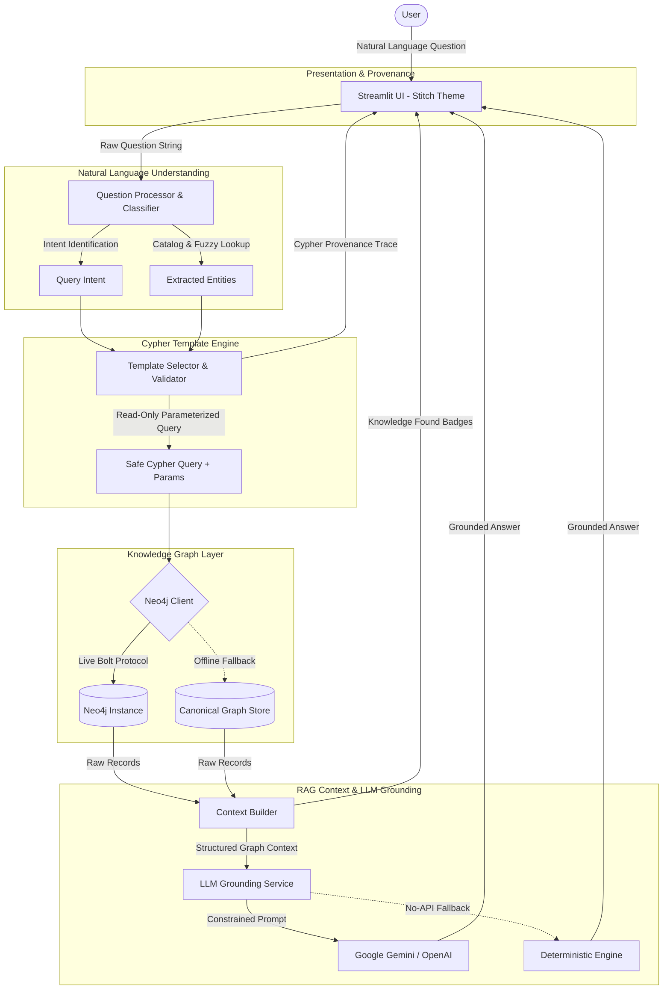

# System Architecture Document – MovieGraph RAG

This document details the architectural design, component interactions, and data flow of the **MovieGraph RAG** application.

---

## 1. High-Level Architecture

MovieGraph AI couples a **Deterministic Knowledge Graph (Neo4j)** with a **Constrained Generative Model (LLM)**.

---

## 2. Component Breakdown

### 2.1 Presentation Layer (`ui/` and `app.py`)
- **Technology:** Streamlit with custom CSS generated from the STITCH design system.
- **Design Tokens:**
  - Canvas: `#FAF8F5` (Warm Ivory)
  - Primary Typography: `#2D3142` (Soft Charcoal, Manrope)
  - Accents: `#B4A7D6` (Dusty Lavender), `#A3B899` (Muted Sage), `#F7D1BA` (Peach), `#B8D8E8` (Powder Blue)
  - Roundness: 20px cards, 9999px pill buttons.
- **Features:**
  - Real-time database connectivity badge.
  - Natural-language search bar with AI sparkle icon.
  - Interactive suggestion chips.
  - Grounded answer bento card with "Knowledge Found" entity badges.
  - Expandable Cypher technical details trace.
  - Dedicated Explainable Recommendations and Graph Explorer tabs.

### 2.2 Question Understanding Layer (`rag/query_classifier.py`)
- **Responsibility:** Maps unstructured text to a structured `QueryIntent`.
- **Techniques:**
  1. **Entity Extraction:** Matches tokens against canonical movie titles and actor/director names in `data/movies_data.py` (case-insensitive with priority for longest matching phrases).
  2. **Intent Classification:** Uses regex patterns and semantic trigger keywords (e.g., `"who directed"`, `"who acted in"`, `"recommend movies like"`, `"movies starring"`).
  3. **Confidence Scoring:** Outputs confidence levels between 0.40 and 0.95.

### 2.3 Cypher Template Engine (`rag/cypher_templates.py`)
- **Responsibility:** Maintains 10 safe read-only Cypher query templates.
- **Security Validation:**
  - Rejects any query containing mutation tokens: `CREATE`, `DELETE`, `DETACH`, `SET`, `MERGE`, `DROP`, `ALTER`, `LOAD CSV`.
  - Enforces strict variable binding via `$title`, `$name`, preventing Cypher injection.

### 2.4 Knowledge Graph Layer (`database/neo4j_client.py`)
- **Driver:** Official `neo4j` Python driver connecting via Bolt protocol (`bolt://localhost:7687` or `neo4j+s://...`).
- **Connection Health Checks:** Performs automated connection testing via `driver.verify_connectivity()`.
- **Fault-Tolerant Fallback:** When Neo4j is offline or credentials are not yet configured, queries seamlessly execute against the in-memory canonical Movies dataset (`data/movies_data.py`), guaranteeing zero downtime during academic demonstrations.

### 2.5 Context Builder (`rag/context_builder.py`)
- Converts raw records from Neo4j into clean, bulleted facts.
- Generates UI entity badges with metadata labels (e.g. `Movie: The Matrix (1999)`, `Director: Lana Wachowski`).
- Emits a sentinel `NO_DATA_FOUND` token when the graph returns zero records.

### 2.6 LLM Grounding Service (`llm/llm_service.py`)
- **Multi-Provider Support:** Google Gemini (`google-genai` / `google-generativeai`) and OpenAI (`openai`).
- **System Instruction Constraints:**
  - Instructs the model to act as a strict factual assistant.
  - Prohibits hallucination or answering from parametric memory.
  - When `NO_DATA_FOUND` is received, immediately outputs: *"I couldn't find that information in the movie knowledge graph."*
- **Deterministic Engine:** Provides grammatical natural language generation when no API keys are supplied, enabling zero-cost local demonstrations.

### 2.7 Recommendation Engine (`recommendation/recommender.py`)
- Traverses 1-hop and 2-hop graph paths:
  - Shared Actors ($Movie_1 \leftarrow [:ACTED\_IN] - Person - [:ACTED\_IN] \rightarrow Movie_2$)
  - Same Director ($Movie_1 \leftarrow [:DIRECTED] - Person - [:DIRECTED] \rightarrow Movie_2$)
- Formulates factual explanation sentences for every recommended film.
- Assigns pastel color tokens (`lavender`, `sage`, `peach`, `powder_blue`) for UI display.
